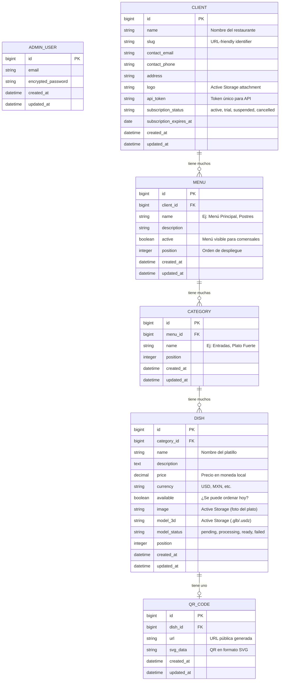

# Arquitectura del Sistema — AR Menu SaaS

Documento técnico que define la arquitectura, modelos de datos, stack tecnológico y estructura del proyecto para el servicio de menús 3D en Realidad Aumentada.

---

## 1. Stack Tecnológico

| Capa              | Tecnología          | Justificación                                                              |
| ----------------- | ------------------- | -------------------------------------------------------------------------- |
| **Backend**       | Rails 8             | Convención sobre configuración, rapidez de desarrollo, API mode incluido   |
| **Base de datos** | PostgreSQL           | Soporte nativo para JSON, full-text search, extensiones                    |
| **Almacenamiento**| Active Storage + S3  | Modelos 3D (`.glb`, `.usdz`) y videos; CDN para distribución global       |
| **Auth Admin**    | Rails 8 Native Auth | Autenticación nativa introducida en Rails 8 (`bin/rails generate authentication`) |
| **Auth API**      | API Token (simple)   | Token por cliente para consumo desde la app móvil (Fase 2)                 |
| **3D Viewer**     | Google Model Viewer  | Web component estándar, soporte AR nativo en iOS/Android                   |
| **QR**            | RQRCode              | Generación de QR codes en Ruby, exportación a SVG/PNG/PDF                  |
| **Pagos**         | Stripe (Fase 3)      | Suscripciones recurrentes, webhooks, portal de cliente                     |
| **3D Pipeline**   | Luma AI API (Fase 3) | Conversión de video a modelo 3D automatizada                               |
| **CSS**           | Tailwind CSS         | Prototipado rápido del panel admin                                         |
| **Deploy**        | Render / Fly.io      | PaaS simple, PostgreSQL gestionado, SSL automático                         |

---

## 2. Diagrama de Datos (ERD)



---

## 3. Estructura de Rutas

### Panel Admin (Autenticado con Devise)

```
/admin
  ├── /dashboard                         → Resumen general (clientes activos, métricas)
  │
  ├── /clients                           → Lista de restaurantes
  │   ├── /new                           → Crear restaurante
  │   ├── /:id                           → Detalle del restaurante
  │   ├── /:id/edit                      → Editar restaurante
  │   │
  │   ├── /:id/menus                     → Menús del restaurante
  │   │   ├── /new                       → Crear menú
  │   │   ├── /:menu_id/edit             → Editar menú
  │   │   │
  │   │   ├── /:menu_id/categories       → Categorías del menú
  │   │   │   ├── /new                   → Crear categoría
  │   │   │   └── /:cat_id/edit          → Editar categoría
  │   │   │
  │   │   └── /:menu_id/dishes           → Platillos del menú
  │   │       ├── /new                   → Crear platillo (subir foto + modelo 3D)
  │   │       └── /:dish_id/edit         → Editar platillo
  │   │
  │   └── /:id/qr_codes                 → QR codes del restaurante (vista PDF)
```

### API v1 (Token Auth — Fase 2)

```
/api/v1
  ├── GET  /my_menus                     → Menús del cliente autenticado
  ├── GET  /menus/:id                    → Detalle de menú con categorías y platillos
  └── GET  /dishes/:id                   → Detalle de platillo con URL del modelo 3D
```

### Vista Pública (Sin auth — Comensal)

```
/v/:client_slug/d/:dish_id               → Página con Model Viewer AR
/v/:client_slug                           → Menú completo del restaurante (listado)
```

---

## 4. Arquitectura de Carpetas del Proyecto

```
ar_app/
├── app/
│   ├── controllers/
│   │   ├── admin/
│   │   │   ├── base_controller.rb       → Auth nativa + layout admin
│   │   │   ├── dashboard_controller.rb
│   │   │   ├── clients_controller.rb
│   │   │   ├── menus_controller.rb
│   │   │   ├── categories_controller.rb
│   │   │   ├── dishes_controller.rb
│   │   │   └── qr_codes_controller.rb
│   │   ├── api/
│   │   │   └── v1/
│   │   │       ├── base_controller.rb   → Token auth
│   │   │       ├── menus_controller.rb
│   │   │       └── dishes_controller.rb
│   │   └── public/
│   │       └── viewer_controller.rb     → Página AR pública
│   │
│   ├── models/
│   │   ├── admin_user.rb
│   │   ├── client.rb
│   │   ├── menu.rb
│   │   ├── category.rb
│   │   ├── dish.rb
│   │   └── qr_code.rb
│   │
│   ├── views/
│   │   ├── admin/                       → Vistas del panel (ERB + Tailwind)
│   │   └── public/
│   │       └── viewer/
│   │           └── show.html.erb        → Model Viewer AR
│   │
│   ├── services/
│   │   ├── qr_code_generator.rb         → Lógica de generación de QR
│   │   └── slug_generator.rb            → Generación de slugs únicos
│   │
│   └── assets/
│       └── stylesheets/
│
├── config/
│   └── routes.rb
│
├── db/
│   └── migrate/
│
├── test/
│   ├── models/
│   ├── controllers/
│   └── services/
│
└── storage/                             → Active Storage (local dev)
```

---

## 5. Seguridad y Consideraciones

| Aspecto                  | Estrategia                                                     |
| ------------------------ | -------------------------------------------------------------- |
| **Auth Admin**           | Autenticación nativa (Generador de Rails 8), sesiones seguras                  |
| **Auth API**             | Token único por cliente en header `Authorization: Bearer`      |
| **Rate Limiting**        | Rack::Attack para endpoints públicos y API                     |
| **CORS**                 | Solo dominios permitidos para API                              |
| **Validaciones**         | Server-side en modelos (presencia, formato, unicidad de slugs) |
| **Almacenamiento**       | Direct Upload a S3 para archivos 3D pesados                   |

---

## 6. Fases de Implementación — Fase 1 Detallada

La Fase 1 se subdivide en **3 etapas** para mantener entregas incrementales:

### Etapa 1.1: Setup del proyecto
- Crear app Rails 8 con PostgreSQL y RSpec
- Generar autenticación nativa de Rails 8 (`bin/rails generate authentication`)
- Configurar Tailwind CSS
- Estructura de rutas base con namespaces `admin`, `api/v1`, `public`

### Etapa 1.2: Modelos y CRUD Admin
- Crear migraciones para `Client`, `Menu`, `Category`, `Dish`, `QrCode`
- Modelos con validaciones y asociaciones
- CRUD completo en `Admin::ClientsController`
- CRUD anidado: Menús → Categorías → Platillos
- Active Storage para logo del cliente e imágenes de platillos

### Etapa 1.3: QR y Vista Pública
- Servicio `QrCodeGenerator` con RQRCode
- Vista PDF de QR codes imprimibles
- Página pública `/v/:slug/d/:id` con Model Viewer
- Previsualización 3D en el admin

---

> [!IMPORTANT]
> Este documento es la referencia técnica para todo el desarrollo. Cada decisión aquí debe validarse antes de escribir código.
